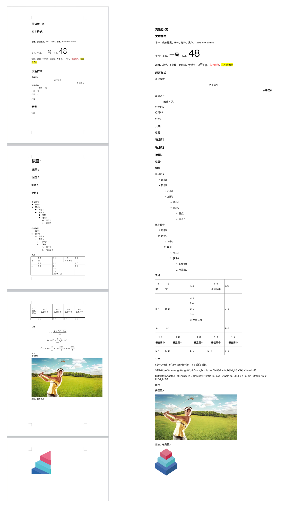

# docx-parser

解析 docx 文件转成 html

效果（左边为 word，右边为 html）：


## ✨ 特性

- 文本样式: 字体、字号、加粗、斜体、下划线、删除线、着重号、上下标、文本颜色、文本高亮
- 段落样式：水平对齐、缩进、行距
- 元素：标题、项目符号、数字编号、表格、公式（omml）、图片
- 其他：页边距、wmf 资源

## 🔨 引入和使用

```
const docx2html = require('@docx-parser/docx2html');

const url = path.join(__dirname, '..', 'assets', 'normal.docx');

docx2html(url).then(html => {
  const url = path.join(__dirname, '..', '.result', 'normal.html');
  fs.writeFileSync(url, html.toString());
  console.log('docx2html done!');
});
```

## 🤝 贡献

开发
```
yarn
yarn dev
```

调试
```
cd examples
yarn
node ./scripts/docx2html.js
```

## 参考项目

- [docx4js](https://github.com/lalalic/docx4js)
- [docx2html](https://github.com/lalalic/docx2html)
- [libwmf](https://github.com/lvyue/libwmf)
- [omml2mathml](https://github.com/scienceai/omml2mathml)
- [mathml-to-latex](https://github.com/asnunes/mathml-to-latex)
